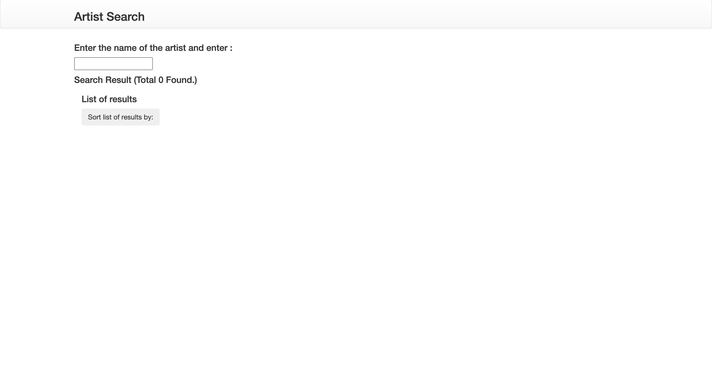
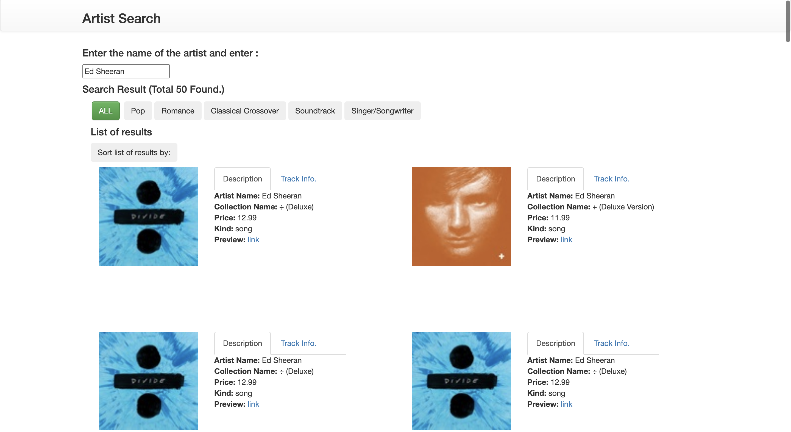
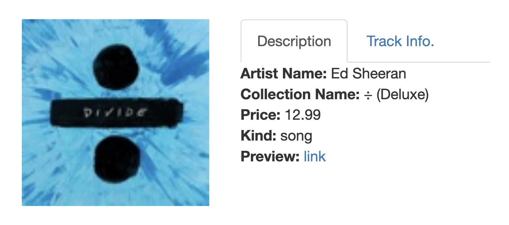
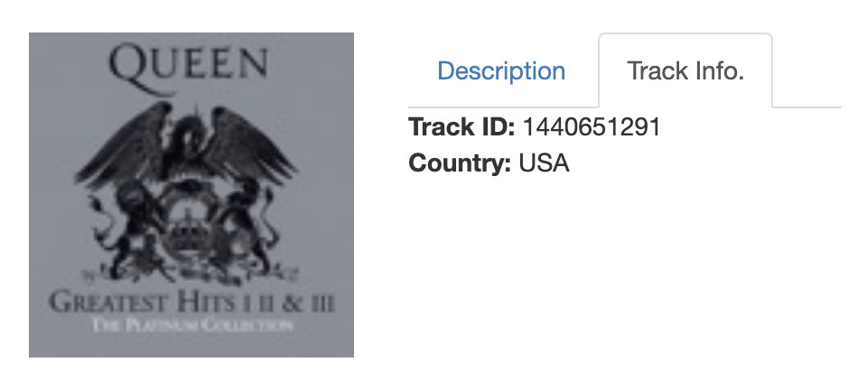

# Artist Search

**Description:**

This is an artist search website. I used MVC pattern in developing the application using Vue.js which is a web application development framework. I also used Bootstrap and Axios. 

The page contains a search bar. After searching for an artist. The Itunes API generates a list of results as well as the genres of the music by the artist. Each item contains a description and a track info.

| home page | after searching for an artist |
| ------ | ------ |
|||

| description | track info |
| ------ | ------ |
|||

A user can select a genre to update the list. They can also sort the list by collection name and price.

| selecting a genre | sorting list |
| ------ | ------ |
|||

Created by Ryota Torii <rtorii@protonmail.com> on 10/29/21.
