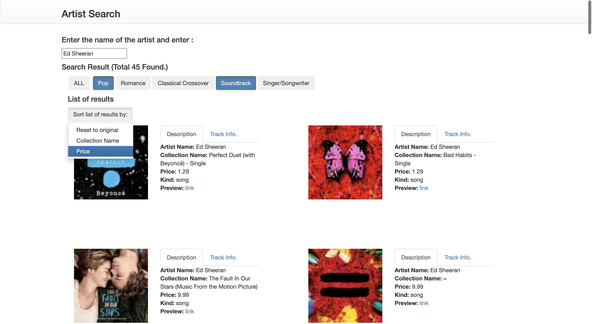

# Artist Search

**Description:**

This is an artist search web application. I used MVC pattern in developing the application using Vue.js which is a web application development framework. I also used Bootstrap which is also a framework. This application requires internet access to get data from the API.

The page contains a search bar. After a user types in an artist and press the enter key, iTunes Search API returns data (JSON object). Then the data is used to generates a list of results as well as the genres of the music by the artist. Each result grid contains an image, a description, and a track info. 

| Home page |Aafter searching for an artist |
| ------ | ------ |
|||

| Description | Track info. |
| ------ | ------ |
|||

A user can select a genre to update the list. They can also sort the list by collection name and price.

| Selecting genres | Sorting the list |
| ------ | ------ |
|||

Created by Ryota Torii <rtorii@protonmail.com> on 10/29/21.
