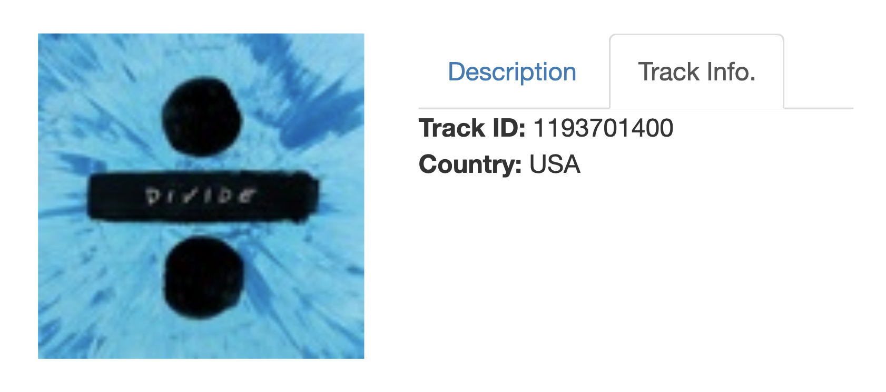
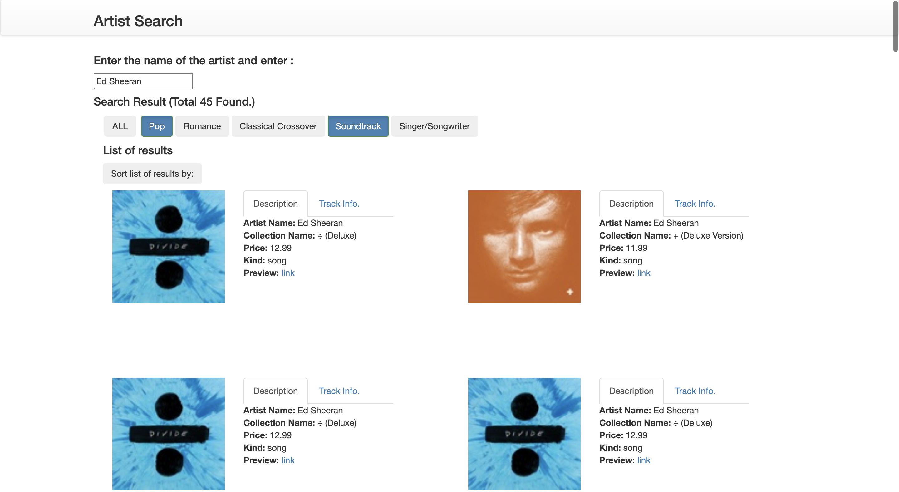

# アーティスト検索 (HTML, CSS, JavaScript)

**説明:**

アーティストを検索すると、そのアーティストのコンテンツ一覧を見ることができるWebアプリです。作成にBootstrapとVue.jsを使用しました。

ウェブサイトには、検索バーがあります。ユーザーがアーティスト名を入力してエンターキーを押すと、iTunes Search APIがデータ（JSONオブジェクト）を返します。そしてそのデータを使って、結果一覧とそのアーティストの音楽のジャンルをウェブサイトに表示します。

| ウェブサイト |アーティストを検索した後 |
| ------ | ------ |
|||

| 説明タブ | トラック情報タブ |
| ------ | ------ |
|||

ジャンルを選択してリストを更新することができます。また、コレクション名と価格でコンテンツの表示順番を変えることができます。

| ジャンルを選択 | 表示順番を変える |
| ------ | ------ |
|||

10/29/21に作成。
